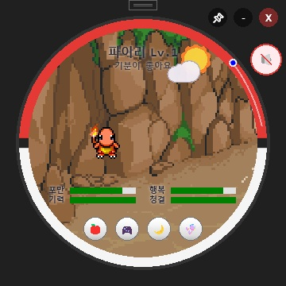
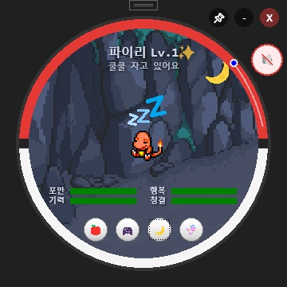
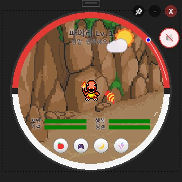
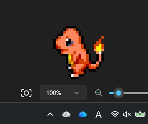
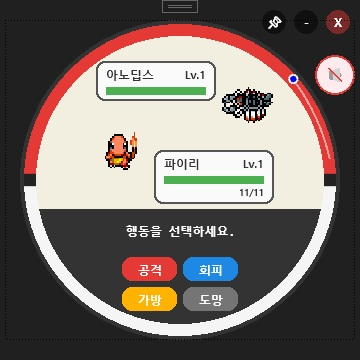
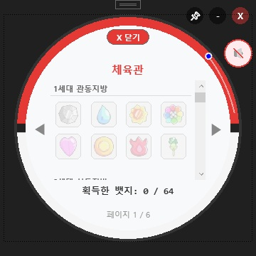
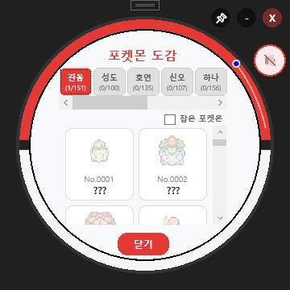
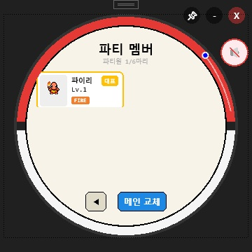
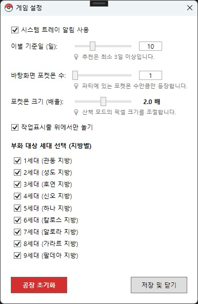
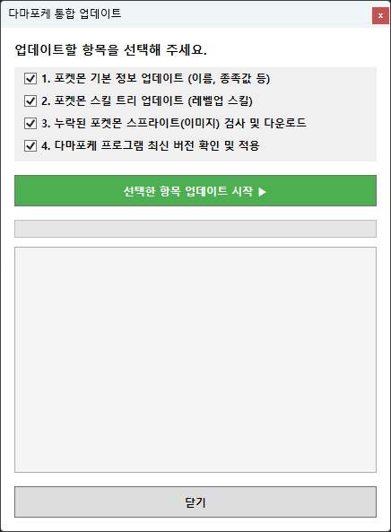

# 🐾 TamaPoke (Desktop Version)

🌐 **[한국어로 읽기 (Korean) 🇰🇷](./README.ko.md)**

> A retro-style Pokemon Tamagotchi desktop widget game reimagined using C# WPF and the MVVM pattern. Raise your own Pokemon on your desktop, evolve them, manage your party, and enjoy battle and capture systems.

<!-- 🌟 TamaPoke Screenshot Gallery (10 Images) -->
| Main Play Screen | Various Idle Animations |
|:---:|:---:|
|  |  |
| **Feeding & Interaction** | **Desktop Walking Mode** |
|  |  |
| **Wild Pokemon Battle** | **Gym Challenge** |
|  |  |
| **Pokedex Collection** | **Party Management** |
|  |  |
| **Detailed Settings** | **Integrated Update System** |
|  |  |

---

## 🎮 User Manual

TamaPoke operates as a floating, semi-transparent widget on your desktop. Left-click your Pokemon to freely move it anywhere on the screen.

### 🔘 Bottom Action Buttons
Manage your Pokemon's core conditions using the four buttons at the bottom of the main screen.
* 🍎 **Feed**: Give delicious berries to increase 'Fullness'.
* 🎮 **Play**: Play with your Pokemon to increase 'Joy', or engage in mini-games and wild battles.
* 🌙 **Sleep**: Put them to sleep to recover 'Energy'.
* 🫧 **Clean**: Bathe them to maintain 'Hygiene'.

### 🖱️ Context Menu (Right-Click)
Right-click your Pokemon to access various systems:
* 📖 **Open Pokedex**: Check the collection records of Pokemon you've met or caught.
* 📋 **Open Profile**: View your Pokemon's level, combat stats, gym badges, and medals.
* 📁 **View Party**: Manage up to 6 party members and swap the Pokemon on your main screen.
* 🎒 **Open Bag**: Check your item inventory, including Poke Balls and Potions.
* 🍃 **Release to Wild**: Say goodbye and release your Pokemon into nature.

### 💻 System Tray Menu
Right-click the system tray icon in the Windows taskbar to quickly access core features and settings.
* **Bring to Front**: Bring the hidden TamaPoke widget back to the top of the screen.
* **Walking Mode**: Toggle the mode where your Pokemon roams freely around the desktop.
* **Settings**: Finely adjust the game environment to your preference.
  * **Use Tray Notifications**: Receive Windows notifications for status changes.
  * **Farewell Age (Days)**: Adjust the base lifespan (in days) before parting with your Pokemon.
  * **Roaming Pokemon Count**: Set the number of party Pokemon that appear during Walking Mode.
  * **Pokemon Size (Scale)**: Adjust the dot pixel size of the Pokemon in Walking Mode.
  * **Taskbar Restriction**: Restrict movement so Pokemon don't hide behind the taskbar.
  * **Hatch Generation Selection**: Select generations (Gen 1 to Gen 9) to encounter Pokemon from specific regions.
* **Check for Updates**: Check for the latest TamaPoke release and update the client.
* **Fully Exit**: Safely save all progress (Pokedex, party, status) and completely close the program.

---

## 🌟 Key Features

* **Desktop Floating Widget**: Real-time status management with a transparent overlay and hover opacity control.
* **Life Cycle & Raising System**: 
  * Manage 4 core stats (Fullness, Joy, Energy, Hygiene) by feeding, playing, sleeping, and cleaning.
  * Features time-based growth and a multi-branch evolution system (including condition requirements and evolution postponement).
  * Safe runaway, release, and emotional farewell mechanisms trigger when the lifespan is reached.
* **Party & Battle/Capture System**: 
  * Keep up to 6 Pokemon in your party and freely swap with your main Pokemon.
  * Intuitive in-game overlay pop-ups for swapping or releasing members when catching a new Pokemon with a full party.
  * Built-in safe synchronization logic to prevent data corruption (cloning bugs) during releases.
* **Mini-Game System**: Manage stats through interactive mini-games like ball bouncing, berry catching, rhythm memory, and cleaning.
* **JSON-Based Data Persistence**: Progress, Pokedex, and party info are safely saved and loaded via JSON save files.

---

## 🛠️ Tech Stack

* **Language**: C#, C++
* **Framework**: WPF (Windows Presentation Foundation), .NET
* **Architecture**: MVVM Pattern
* **Data Storage**: JSON

---

## 🔗 References (Open Source Projects)

This desktop project was reimagined for the desktop environment by referencing the game loops, planning, and ideas from the following embedded/web-based original `TamaPoke` projects:

* [socquique/TamaPoke](https://github.com/socquique/TamaPoke) — Original firmware and basic Tamagotchi mechanics.
* [ShadowEnemyx/TamaPoke (Expanded Update)](https://github.com/ShadowEnemyx/TamaPoke/tree/tamapoke-expanded-update) — Expanded features and content references.
* [DylanPDao/TamaPoke](https://github.com/DylanPDao/TamaPoke) — Battle and additional system expansion ideas.

---

## 📝 Credits & Acknowledgements

* **Sprite Assets**: All Pokemon dot sprites used in this game utilize the original resources from the Pokemon Mystery Dungeon community's open-source project, [PMDCollab/SpriteCollab](https://github.com/PMDCollab/SpriteCollab). Deep thanks to the community contributors for providing high-quality sprites.
  * These resources are used strictly for non-commercial purposes under the **Creative Commons Attribution-NonCommercial 4.0 International (CC BY-NC 4.0)** license.
  * Read the full license: [https://creativecommons.org/licenses/by-nc/4.0/](https://creativecommons.org/licenses/by-nc/4.0/).
* **Badge Images**: Gym badge images reference and cite materials from [Bulbapedia](https://bulbapedia.bulbagarden.net/wiki/Main_Page).
* **Disclaimer**: This is a non-commercial fan project. All copyrights and trademarks related to Pokémon belong to Nintendo, Creatures Inc., and GAME FREAK inc.
